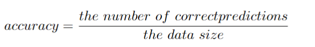
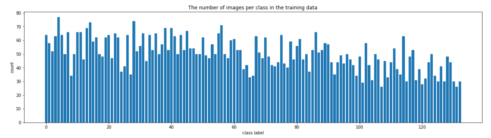
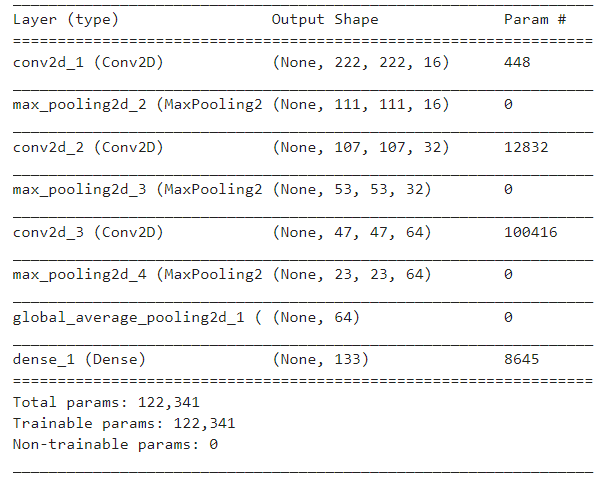
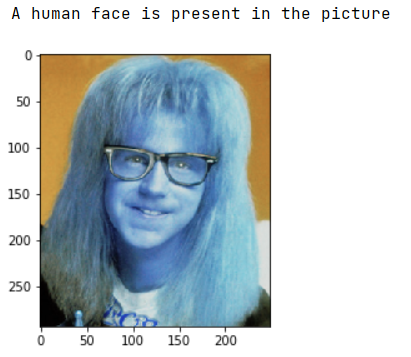
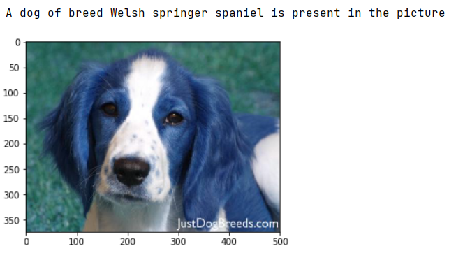
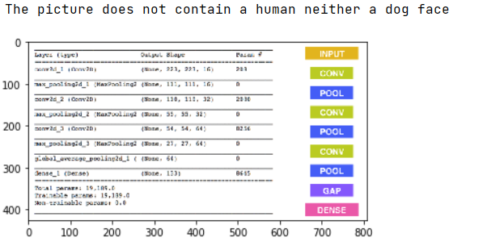

[//]: # (Image References)

[image1]: ./images/sample_dog_output.png "Sample Output"
[image2]: ./images/vgg16_model.png "VGG-16 Model Keras Layers"
[image3]: ./images/vgg16_model_draw.png "VGG16 Model Figure"


## Problem Overview

In this project, Convolutional Neural Networks are used to detect and recognise Dog's breed in images. The power of transfer learning is demonstrated through the use of several state-of-the-art models. The ResNe50 model provided the best accuracy and was deployed in a flask web-application. We want to detect human and dog faces. When a dog is detected, his breed is also
identified using CNN models. The project combines a series of models designed to perform various tasks in 
a data processing pipeline.  

Several state-of-the-art classification CNN models are explored for breed classification. Only the best performing
model is saved to be used in real scenarios. 

## Strategy to solve the problem

The project contains two parts. The first part is concerned about building suitable
models that will allow to achieve the overall goal of the project. The second part
focuses on deploying the models in a web application.

1. [Model Development](https://github.com/BHafsa/Dog-breed-classification/tree/main/model_exploration/dog_app.ipynb)
During this first part, two detectors are used. The first one is based on cascade features and
open-cv2 to detect human faces. The second detector uses the ResNet pre-trained model
to detect the presence of dogs in an image. Finally, transfer learning is used to detect the breed of 
the detected dogs.

2. [A flask application](https://github.com/BHafsa/Dog-breed-classification/tree/web_app)
The second part of the project is concerned about providing a user-friendly tool
that allow to test the model and see how it is performing on custom images. The tool
is an interactive flask web application that allow to upload an image and detects 
the dogs and humans.

Three different datasets were used during the current project:

1. [dog dataset](https://s3-us-west-1.amazonaws.com/udacity-aind/dog-project/dogImages.zip)
2. [human dataset](https://s3-us-west-1.amazonaws.com/udacity-aind/dog-project/lfw.zip)
3. [VGG-16 bottleneck features](https://s3-us-west-1.amazonaws.com/udacity-aind/dog-project/DogVGG16Data.npz)

## Metrics

The metric used during the current project is the accuracy which is given by the following formula:



The accuracy is appropriate to be used in the case of the current problem since the dataset contains a more or less balanced distribution of images across different classes.

## Exploratory data analysis

The considered human dataset contained 13233 total human images. On the other hand, dog's breed dataset can be described as follows:

1. Size of the Dataset \begin{itemize}
       - 133 total dog categories.
       - 8351 total dog images.


2. Size of data after splitting
        - 6680 training dog images.
        - 835 validation dog images.
        - 836 test dog images.



The training data is more or less homogeneously distributed across the 133 classes and therefore we don't need to fix unbalanced classes. This would mean that using the accuracy to evaluate the model would not be a problem.

## Modelling

### Face Detector

We use OpenCV's implementation of Haar feature-based cascade classifiers\footnote{http://docs.opencv.org/trunk/d7/d8b/tutorial_py_face_detection.html} to detect human faces in images.  OpenCV provides many pre-trained face detectors, stored as XML files on github\footnote{https://github.com/opencv/opencv/tree/master/data/haarcascades}.  

### Dog Detector

we use a pre-trained [ResNet-50](http://ethereon.github.io/netscope/#/gist/db945b393d40bfa26006)  model to detect dogs in images.  We download the model  along with weights that have been trained on [Image net website](http://www.image-net.org/), a very large, very popular dataset used for image classification and other vision tasks.  ImageNet contains over 10 million URLs, each linking to an image containing an object from one of [1000 categories](https://gist.github.com/yrevar/942d3a0ac09ec9e5eb3a).  Given an image, this pre-trained ResNet-50 model returns a prediction (derived from the available categories in ImageNet) for the object that is contained in the image. In order to check if an image is predicted to contain a dog by the pre-trained ResNet-50 model, we need only check if the class returned by the model is between 151 and 268 (inclusive). 

### Breed classification

The breed classification is the main problem that we are interested in investigating. Therefore, we consider different alternatives for this part, as follows:

#### 1. modeling from scartch: 

We use in this first step the recommended architecture provided by Udacity. This architecture is based on convolutional layers that excel in image recognition tasks. The architecture is composed of three successive convolutional layers followed by a averaging layer and a dense layer with a sigmoid function.



#### 2. using tranfer Learning:

  In the second step, we use transfer learning to create a CNN using  bottleneck features from  different pre-trained models.  To make things easier, we use pre-computed features for all of the networks that are currently available in Keras for the following models:
- [VGG-19](https://s3-us-west-1.amazonaws.com/udacity-aind/dog-project/DogVGG19Data.npz), 
- [ResNet-50](https://s3-us-west-1.amazonaws.com/udacity-aind/dog-project/DogResnet50Data.npz) and 
- [VGG16](https://s3-us-west-1.amazonaws.com/udacity-aind/dog-project/DogVGG16Data.npz).

## Results

1. The Face detection model resulted in the following:

- The percentage of the first 100 images in human files, that have a detected human face, is: 100\%
- The percentage of the first 100 images in dog files, that have a detected human face, is: 11\%

This algorithmic choice necessitates that we communicate to the user that we accept human images only when they provide a clear view of a face (otherwise, we risk having unnecessarily frustrated users!). However, expecting the user to always provide a clear image is not reasonable and will make them abstain from using the app. It would rather be more efficient to take this into consideration during the development of the model. We can use instead a CNN model that is already trained on an augmented data containing a portion of unclear images(e.g., adding blur), which will allow to algorithm to detect even unclear images. Nonetheless, we will stick with the cascade classifier for our algorithm since the most important task is to identify the dog's breed.

2. The Dog detection model resulted in the following:
- The percentage of the first 100 images in human files, that have a detected dog, is: 0\%
- The percentage of the first 100 images in dog files, that have a detected dog, is: 100

3. Breed classification

At first  all of the considered models were trained only for 20 epochs to have a first idea about their performance with a learning rate of 0.001. 
Unfortunately, the accuracy obtained with the CNN developed from scratch is very low (around 7\%) and show that this model will not perform properly if we use it in our application. 


On the other hand, using transfer learning from different models shows that after only 20 epochs a minimum accuracy of 40\% on validation data can be achieved.
The plots of the losses shows that the ResNet50 have approximately a constant validation loss after the first few epochs. On the other hand, the VGG16 and VGG19 have an increasing losses that seem to still are improving. This ResNet50 demonstrated an accuracy of 81\% on testing data. This last observation, encouraged the author to trained for more epochs, precisely 200 epochs, showed in the previous plot.

## Conclusion

The current project investigated different alternative when addessing an image classification problem. The transfer learning demonstarted by far the best performance for the considered data. An accuarcy of 81\% was achieved using the ResNet where it improved the results by a factor of 10. Figures below show some examples of generated predictions:







## Improvements

The results obtained are impressing. However, further improvements are still possible using:

1. The human detector can be improved using a CNN model.
2. Data augmentation: the images from each class can be augmented and this will improve the performance of the model.
3. Cross validation would allow to better assess the generalisability of the model 


## Requirements
The following packages are required to run the code in the current project:

```
pip install tensorflow
pip install matplotlib
pip install numpy
pip install pandas
pip install tqdm
pip install flask
```


## Creator

**Bousbiat Hafsa**

- https://www.linkedin.com/in/hafsa-bousbiat-535ba6ba/
- https://github.com/BHafsa


## Copyright and license

Code released under the [MIT Licence](https://github.com/BHafsa/Dog-breed-classification/blob/main/LICENSE). 


